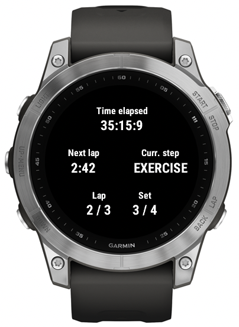

# Training Buddy

This project is used for individual trainings for the Garmin watches. It includes trainings that cannot be created with the standard training plans, e.g. interval trainings.

## Interface

The interface is devided into 5 secions. 

* On top, you see the elaped time of the current training.
* In the middle, you see the remaining time of the current lap and the current step of the program (e.g. `PREPARE`, `WARMUP`, `EXERCISE`, `PAUSE`)
* The bottom shows the lap and step counter of the current training.

## Training plans

This sections explains the different type of training plans available in this application.

### Inteval training

The interval training consists of four different exercises, that are repeated three times each.

By starting an interval training, the first step is a simple warmup, until the lap button is pressed. Afterwards, the intervals start with a duration of 3 minutes. In this time the user shall repeat the current exercise for 6 - 12 times and press the lap button after completion. The remaining time of the interval will be a pause to regenerate. When the time is over, the next interval starts.

A new set (with a different exercise) will start at after an exercise is repeated 3 times in a row. When all sets are finished, there is an extra step for cooldown.
